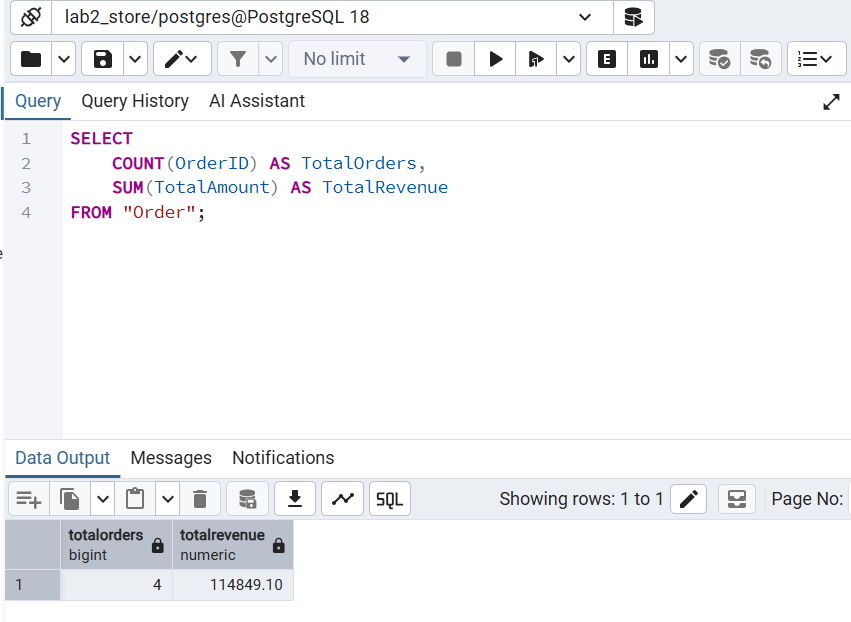
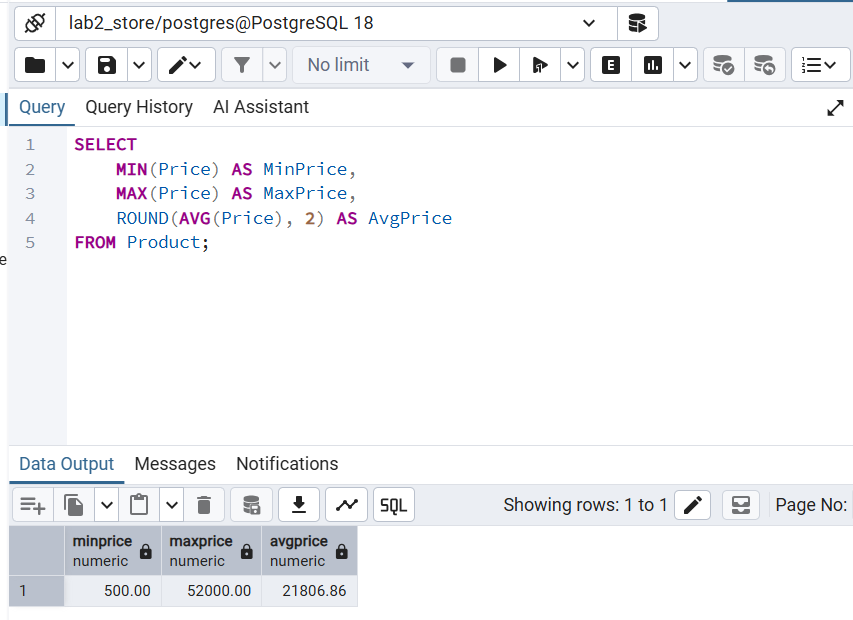
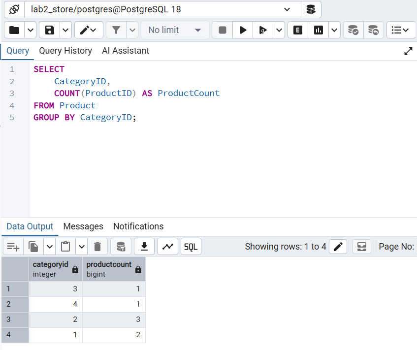
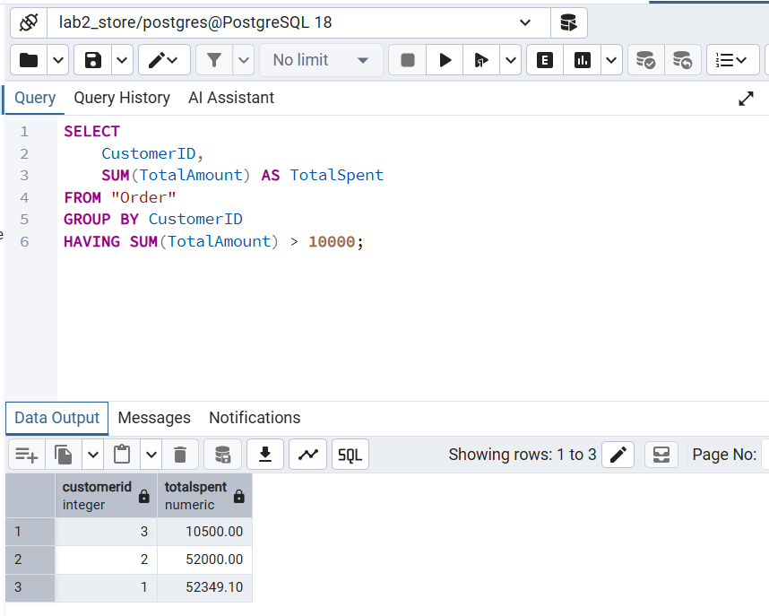
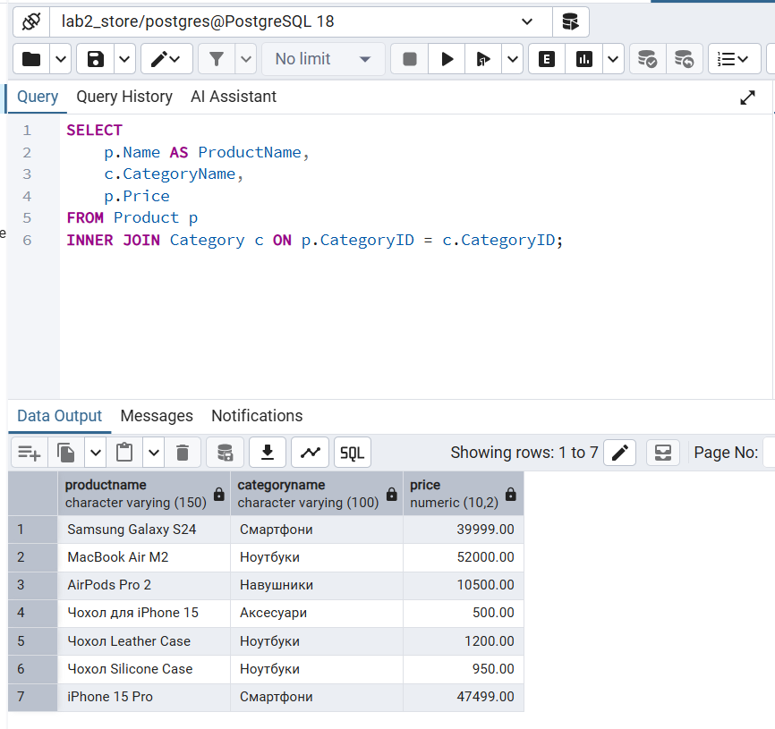
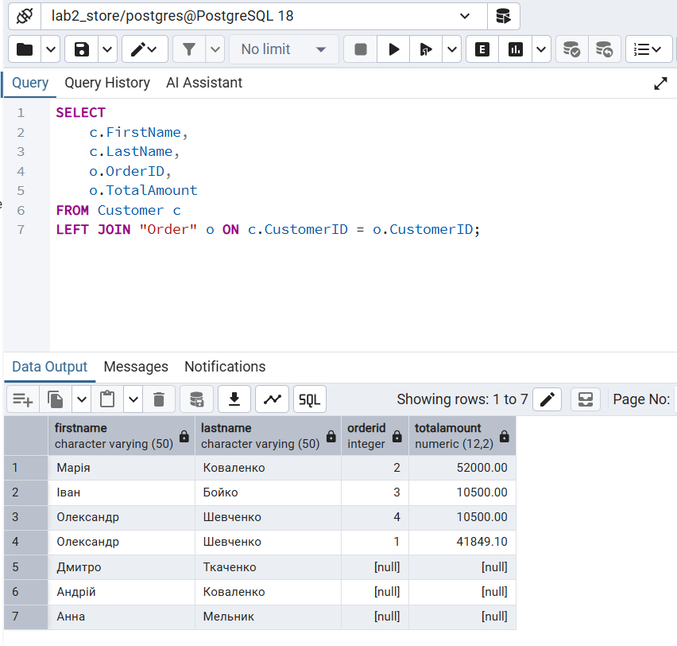
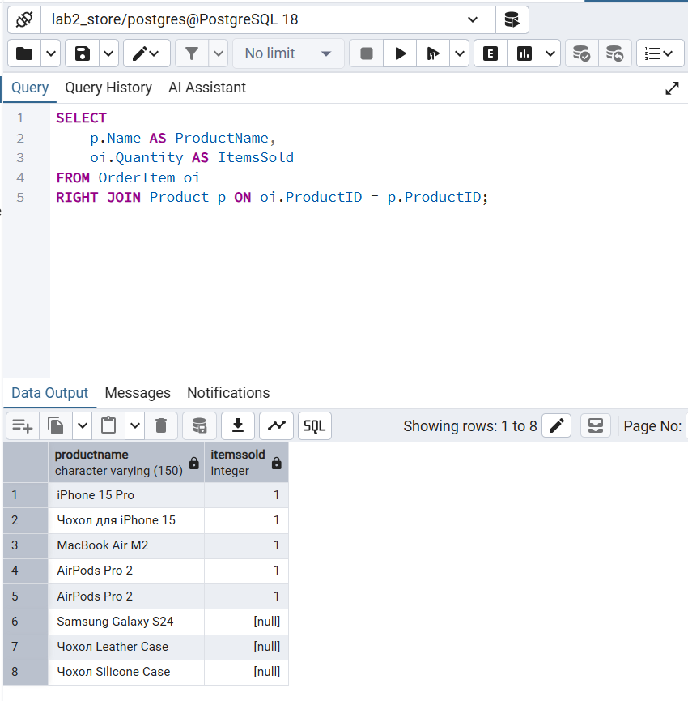
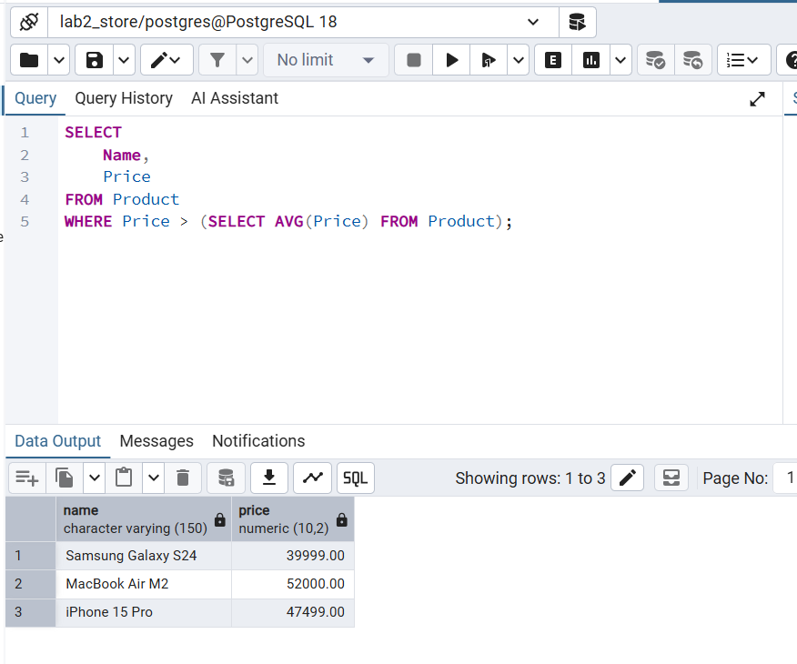
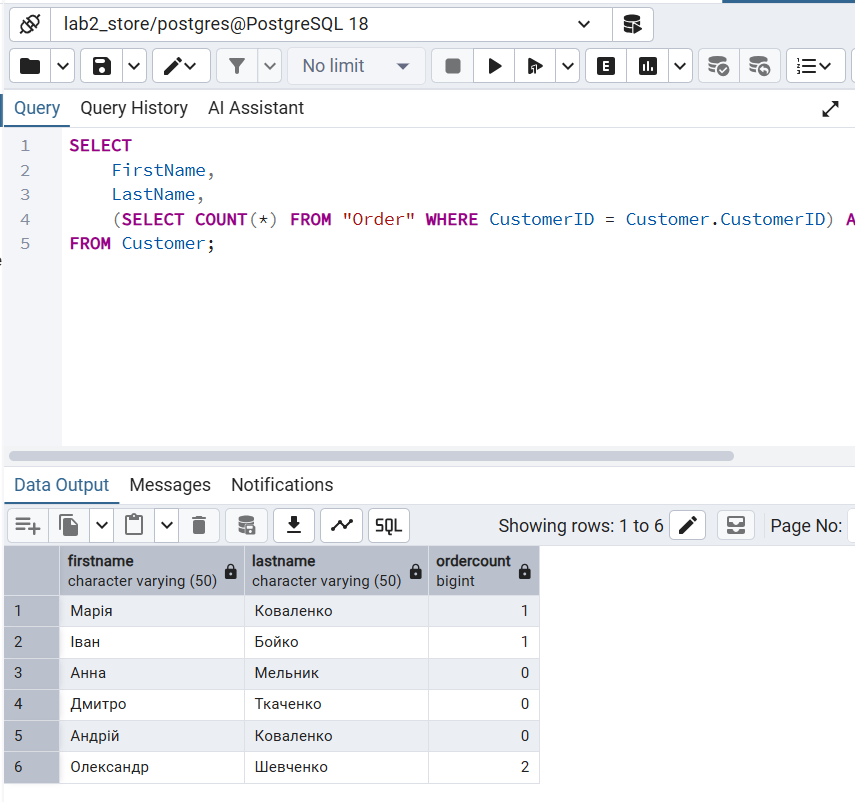
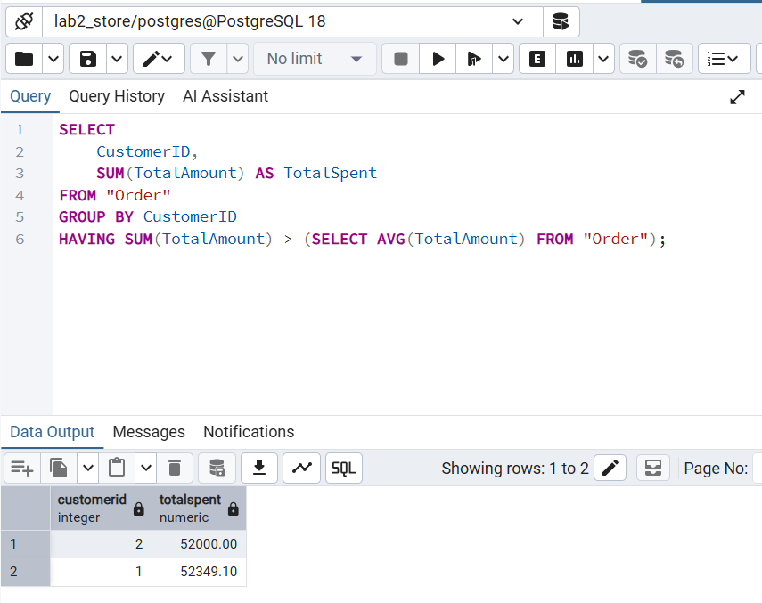

# Лабораторна робота 4: Аналітичні SQL-запити (OLAP)

**Виконав(ла):** [Твоє Прізвище та Ім'я]  
**Тема:** Використання агрегатних функцій, об'єднань (JOIN) та підзапитів для аналізу даних інтернет-магазину.

---

## Частина 1: Базова агрегація та групування (4 запити)

**Запит 1: Загальна статистика замовлень (COUNT, SUM)**
*Опис:* Рахує загальну кількість оформлених замовлень у магазині та їхню сумарну вартість (дохід).
```sql
SELECT 
    COUNT(OrderID) AS TotalOrders, 
    SUM(TotalAmount) AS TotalRevenue 
FROM "Order";
```
## Результат виконання:


**Запит 2: Аналіз цін на товари (MIN, MAX, AVG)**
Опис: Обчислює мінімальну, максимальну та середню ціну серед усіх товарів у каталозі.
```sql
SELECT 
    MIN(Price) AS MinPrice, 
    MAX(Price) AS MaxPrice, 
    ROUND(AVG(Price), 2) AS AvgPrice 
FROM Product;
```
## Результат виконання:


**Запит 3: Кількість товарів у кожній категорії (GROUP BY)**
Опис: Групує товари за категоріями і показує, скільки найменувань товарів є в кожній з них.
```sql
SELECT 
    CategoryID, 
    COUNT(ProductID) AS ProductCount 
FROM Product 
GROUP BY CategoryID;
```
## Результат виконання:


**Запит 4: Фільтрація згрупованих даних (HAVING)**
Опис: Знаходить "VIP-клієнтів", тобто тих, хто сумарно витратив у нашому магазині більше ніж 10 000 грн.
```sql
SELECT 
    CustomerID, 
    SUM(TotalAmount) AS TotalSpent 
FROM "Order" 
GROUP BY CustomerID 
HAVING SUM(TotalAmount) > 10000;
```
## Результат виконання:


## Частина 2: Об'єднання таблиць (3 запити)
**Запит 5: Внутрішнє об'єднання (INNER JOIN)**
Опис: Виводить список усіх товарів, але замість незрозумілого CategoryID показує реальну назву категорії з таблиці Category.
```sql
SELECT 
    p.Name AS ProductName, 
    c.CategoryName, 
    p.Price 
FROM Product p
INNER JOIN Category c ON p.CategoryID = c.CategoryID;
```
## Результат виконання:


**Запит 6: Ліве об'єднання (LEFT JOIN)**
Опис: Показує всіх зареєстрованих клієнтів та суми їхніх замовлень. LEFT JOIN гарантує, що ми побачимо навіть тих клієнтів, які ще не зробили жодного замовлення (для них значення буде NULL).
```sql
SELECT 
    c.FirstName, 
    c.LastName, 
    o.OrderID, 
    o.TotalAmount 
FROM Customer c
LEFT JOIN "Order" o ON c.CustomerID = o.CustomerID;
```
## Результат виконання:


**Запит 7: Праве об'єднання (RIGHT JOIN)**
Опис: Аналізує історію продажів товарів. Праве об'єднання покаже всі товари з каталогу, навіть якщо їх ще жодного разу не купували (в таблиці OrderItem для них буде пусто).
```sql
SELECT 
    p.Name AS ProductName, 
    oi.Quantity AS ItemsSold 
FROM OrderItem oi
RIGHT JOIN Product p ON oi.ProductID = p.ProductID;
```
## Результат виконання:


## Частина 3: Підзапити (3 запити)
**Запит 8: Підзапит в умові WHERE**
Опис: Знаходить товари, які відносяться до "преміум" сегменту, тобто їхня ціна вища за середню ціну всіх товарів у магазині.
```sql
SELECT 
    Name, 
    Price 
FROM Product 
WHERE Price > (SELECT AVG(Price) FROM Product);
```
## Результат виконання:


**Запит 9: Підзапит у блоці SELECT**
Опис: Для кожного клієнта виводить його ім'я та окремим стовпцем підраховує кількість його замовлень, використовуючи корельований підзапит.
```sql
SELECT 
    FirstName, 
    LastName, 
    (SELECT COUNT(*) FROM "Order" WHERE CustomerID = Customer.CustomerID) AS OrderCount 
FROM Customer;
```
## Результат виконання:


**Запит 10: Підзапит у блоці HAVING**
Опис: Знаходить клієнтів, чия загальна сума покупок перевищує середній чек по всьому магазину.
```sql
SELECT 
    CustomerID, 
    SUM(TotalAmount) AS TotalSpent 
FROM "Order" 
GROUP BY CustomerID 
HAVING SUM(TotalAmount) > (SELECT AVG(TotalAmount) FROM "Order");
```
## Результат виконання:


## Висновок
# Під час виконання лабораторної роботи №4 було опановано інструменти OLAP для аналітики даних за допомогою SQL. Написано запити з використанням агрегатних функцій (COUNT, SUM, AVG, MIN, MAX), реалізовано групування результатів (GROUP BY, HAVING), а також створено складні звіти, що використовують об'єднання (JOIN) та підзапити. Усі запити успішно протестовані та повертають коректні аналітичні вибірки.
