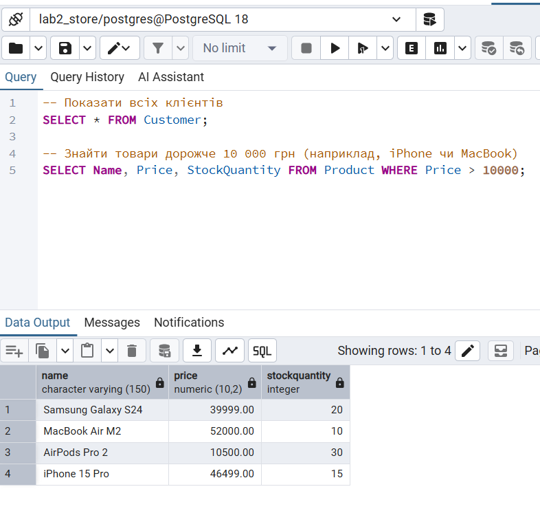
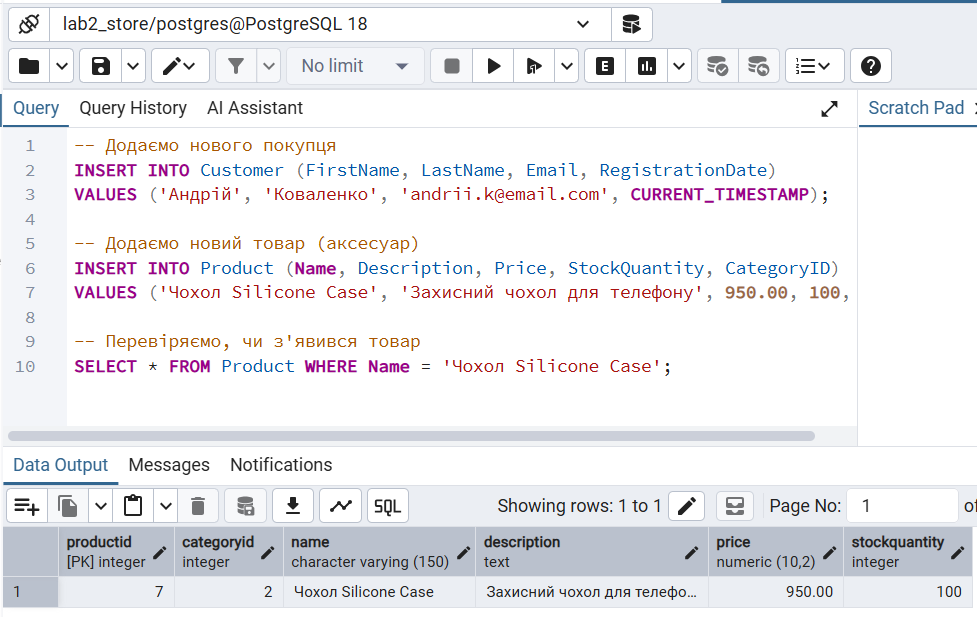
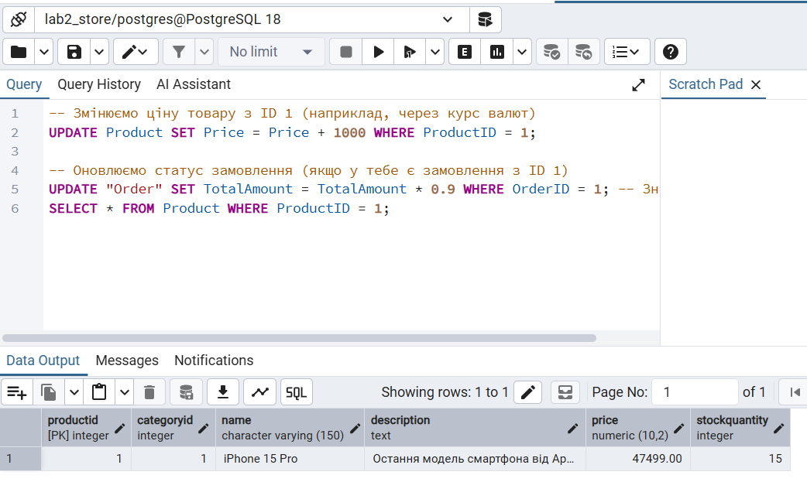
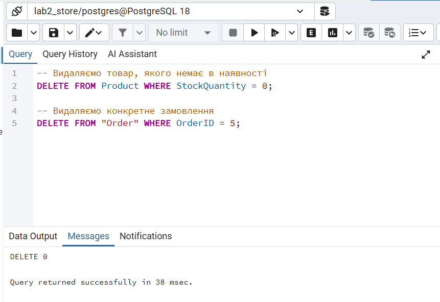

# Лабораторна робота №3: Маніпулювання даними (OLTP)

**Виконав:** Чігарев Олександр
**Тема:** Операції з даними (INSERT, UPDATE, DELETE, SELECT) у базі даних магазину.

---

## Завдання 1: Вибірка даних (SELECT)
Отримання списку всіх клієнтів та пошук товарів, ціна яких вища за 10 000 грн.

```sql
-- Показати всіх клієнтів
SELECT * FROM Customer;

-- Знайти товари дорожче 10 000 грн
SELECT Name, Price, StockQuantity FROM Product WHERE Price > 10000;
```
## Результат виконання:


## Завдання 2: Додавання нових записів (INSERT)
Реєстрація нового клієнта та додавання нового товару (чохла) до каталогу.
```sql
-- Додаємо нового покупця
INSERT INTO Customer (FirstName, LastName, Email, RegistrationDate)
VALUES ('Андрій', 'Коваленко', 'andrii.k@email.com', CURRENT_TIMESTAMP);

-- Додаємо новий товар
INSERT INTO Product (Name, Description, Price, StockQuantity, CategoryID)
VALUES ('Чохол Silicone Case', 'Захисний чохол для телефону', 950.00, 100, 4);

-- Перевірка доданого товару
SELECT * FROM Product WHERE Name = 'Чохол Silicone Case';
```
## Результат виконання:


## Завдання 3: Оновлення даних (UPDATE)
Коригування ціни товару та нарахування знижки на замовлення.
```sql
-- Змінюємо ціну товару (наприклад, через інфляцію)
UPDATE Product SET Price = Price + 1000 WHERE ProductID = 1;

-- Надаємо знижку 10% на конкретне замовлення
UPDATE "Order" SET TotalAmount = TotalAmount * 0.9 WHERE OrderID = 1;

-- Перевірка оновлення
SELECT * FROM Product WHERE ProductID = 1;
```
## Результат виконання:


## Завдання 4: Видалення даних (DELETE)
Видалення товарів, яких немає в наявності, та видалення конкретного замовлення.
```sql
-- Видаляємо товари з нульовим залишком
DELETE FROM Product WHERE StockQuantity = 0;

-- Видаляємо конкретне замовлення за ID
DELETE FROM "Order" WHERE OrderID = 5;
```
## Результат виконання:


## Висновок
Під час виконання лабораторної роботи №3 було опановано практичні навички роботи з DML-запитами в PostgreSQL. Навчився працювати з основними операторами: додавання, вибірка, зміна та видалення даних. Всі запити виконані успішно, цілісність даних збережена.
